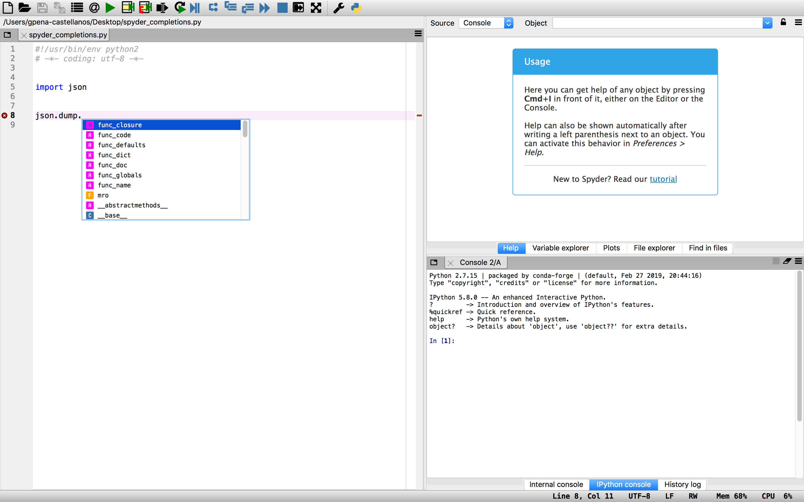
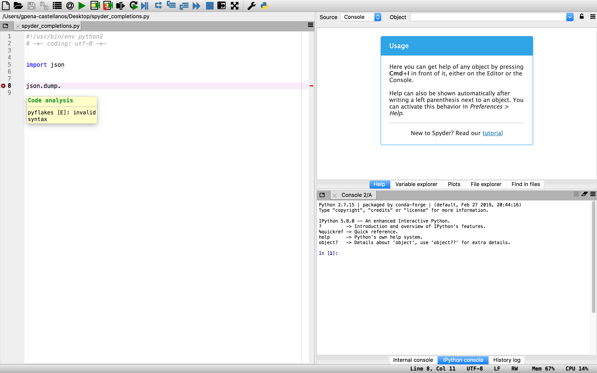

# Python Language Server

 

A Python 2.7 and 3.5+ implementation of the [Language Server Protocol](https://github.com/Microsoft/language-server-protocol).

## Installation

The base language server requires [Jedi](https://github.com/davidhalter/jedi) to provide Completions, Definitions, Hover, References, Signature Help, and Symbols:

``pip install spyder-pyls``

If the respective dependencies are found, the following optional providers will be enabled:

* [Rope](https://github.com/python-rope/rope) for completions and renaming
* [Pyflakes](https://github.com/PyCQA/pyflakes) linter to detect various errors
* [McCabe](https://github.com/PyCQA/mccabe) linter for complexity checking
* [pycodestyle](https://github.com/PyCQA/pycodestyle) linter for style checking
* [pydocstyle](https://github.com/PyCQA/pydocstyle) linter for docstring style checking (disabled by default)
* [autopep8](https://github.com/hhatto/autopep8) for code formatting
* [YAPF](https://github.com/google/yapf) for code formatting (preferred over autopep8)

Optional providers can be installed using the `extras` syntax. To install [YAPF](https://github.com/google/yapf) formatting for example:

`pip install 'spyder-pyls[yapf]'`

All optional providers can be installed using:

`pip install 'spyder-pyls[all]'`

If you get an error similar to `'install_requires' must be a string or list of strings` then please upgrade setuptools before trying again. 

`pip install -U setuptools`

## 3rd Party Plugins

Installing these plugins will add extra functionality to the language server:

* [pyls-mypy](https://github.com/tomv564/pyls-mypy) Mypy type checking for Python 3
* [pyls-isort](https://github.com/paradoxxxzero/pyls-isort) Isort import sort code formatting
* [pyls-black](https://github.com/rupert/pyls-black) for code formatting using [Black(https://github.com/ambv/black)

Please see the above repositories for examples on how to write plugins for the Python Language Server. Please file an
issue if you require assistance writing a plugin.

## Configuration

Configuration is loaded from zero or more configuration sources. Currently implemented are:

* pycodestyle: discovered in `~/.config/pycodestyle`, `setup.cfg`, `tox.ini` and `pycodestyle.cfg`
* flake8: discovered in `~/.config/flake8`, `setup.cfg`, `tox.ini` and `flake8.cfg`

The default configuration source is pycodestyle. 

## Language Server Features

* Code completion

* Code linting (Warnings and errors)

## Development

To run the test suite:

``pip install .[test] && tox``

## Develop against Spyder

The Python language server can be developed against a local instance of Spyder IDE.

1. Install it with `pip install -e .`
2. Start Spyder in debug mode (`python bootstrap.py --debug`)
3. Check logs for both client and server in `~/.spyder-py3/lsp-logs`

## License

This project is made available under the MIT License.

## Sponsors

Spyder is funded thanks to the generous support of

and the donations we have received from our users around the world through [Open Collective](https://opencollective.com/spyder/):

